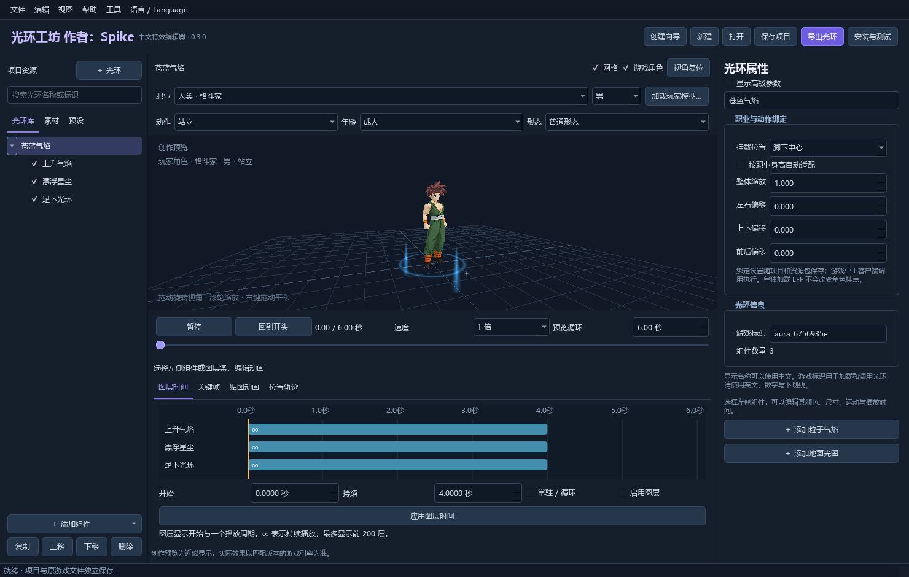

# DBO-Aura · 光环工坊 作者：Spike

Windows 64 位 DBO 光环制作与预览工具，支持简体中文与 English。

**[下载最新发行版](https://github.com/kanggou/DBO-Aura/releases/latest)** · **[中文使用说明](docs/使用说明.md)**

## 开始使用

1. 在 Releases 下载 `光环工坊_0.3.0.zip`，完整解压。
2. 双击 `光环工坊 作者：Spike.exe`，保留同目录 `_internal` 文件夹。
3. 在“语言 / Language”选择简体中文或 English，选择会在重启后保留。
4. 从“创建向导”开始，保存 `.aura` 工程，再导出游戏资源 ZIP。

## 功能

- 9 类 EFF 104 组件、分层时间、关键帧、贴图动画与位置轨迹。
- 角色职业、动作、体型与形态预览，以及光环挂点设置。
- 工程保存、个人预设、资源导出、测试安装、还原和观察记录。
- 中英文界面即时切换，作者署名 Spike。

界面预览属于创作参考；游戏内选择与挂点执行需要匹配客户端接入。
当前发行版未完成真实游戏内验证，安装资源本身不会增加游戏选择菜单。

## 下载内容

Releases 提供便携程序 ZIP、9 页 PDF 使用说明和 SHA-256 校验清单。
公开仓库存放文档、截图与许可文件。GitHub 自动生成的 `Source code`
压缩包只包含这些仓库文件；运行程序请下载 `光环工坊_0.3.0.zip`。
软件业务源码不在本仓库中。原生编译、混淆和字符串加密可提高逆向成本，
不承诺绝对无法逆向；项目与游戏素材仍保留其资源格式。

## 许可

Copyright (c) 2026 Spike。软件采用 [专有软件许可](LICENSE)，允许免费使用，
源码不公开；修改和再分发等权限须另行取得。请通过本仓库链接分享下载。
这不是 MIT 或 GPL 软件发行。第三方组件遵循 [各自的许可](第三方许可.txt)，
游戏素材的权利属于原权利人，不在本软件许可授权范围内。

## English

Aura Workshop is a Windows x64 editor for DBO aura projects. Download the portable
ZIP from Releases, extract the entire folder and run the executable. Choose
English from the **语言 / Language** menu. Python installation is not required.

The application is proprietary; business source code is not published here.
See LICENSE for the free-use grant and restrictions. Third-party components
retain their own licenses. In-game integration and rendering remain unverified
for the local target client. This project is not an official game product.
