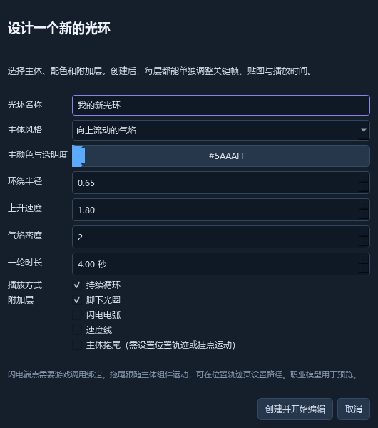
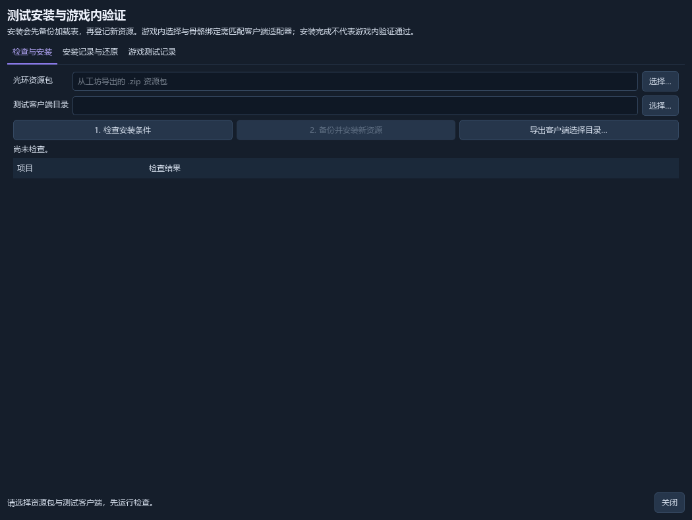

# 光环工坊 使用说明

**作者：Spike · 适用版本：0.3.0 · 说明日期：2026-09-21**

用于 Dragon Ball Online 光环创作、角色动作预览、工程保存、资源导出和测试安装。软件内可选择简体中文或 English；本说明以中文按钮名称为准。

## 01｜第一次启动与快速开始

### 启动软件

1. 完整解压 `光环工坊_0.3.0.zip`，打开解压后的文件夹。
2. 双击 `光环工坊 作者：Spike.exe`。无需安装 Python。
3. 保留 EXE 旁的 `_internal` 文件夹及其他配套文件。请将整个程序文件夹放在可写的位置。
4. 示例位于程序文件夹中的“示例项目”，可先用“打开”加载 `苍蓝气焰.aura` 或 `进阶光环示例.aura`。

### 切换中英文

从顶部 **“语言 / Language”** 选择 **“简体中文”** 或 **“English”**。切换立即生效，并在重启后保留。当前项目、未保存修改、素材名称与路径保持原内容。

英文界面中的中文工程名、素材名属于原有数据。如需改名，请在相应名称输入框中自行编辑。

### 推荐的第一次操作

1. 点击“创建向导”，保留默认主体、颜色及脚下光圈，点击“创建并开始编辑”。
2. 在左侧展开新光环，选择“主体气焰”；在右侧查看颜色、尺寸和发射参数。
3. 切换职业与动作，观察站立、跑动和蓄气时的效果。
4. 点击“保存项目”，保存为自己的 `.aura` 文件。
5. 选中要使用的光环，点击“导出光环”，生成用于游戏资源登记的 ZIP。

**制作流程：创建 → 调整组件 → 动作预览 → 保存工程 → 导出资源 → 测试安装。**

## 02｜认识工作界面

| 区域 | 主要用途 |
| --- | --- |
| 顶部菜单与按钮 | 创建向导、新建、打开、保存项目、导出光环、安装与测试；语言菜单也在这里。 |
| 左侧“项目资源” | 在“光环库”选择光环或组件；在“素材”导入资源；在“预设”选用内置效果。 |
| 中央预览区 | 观察人物、光环、网格和运动；上方选择职业、性别、动作、年龄及形态。 |
| 下方播放与时间轴 | 暂停、回到开头、预览速度及循环长度；编辑图层时间、关键帧、贴图动画和位置轨迹。 |
| 右侧属性区 | 选中光环时编辑整体信息与挂点；选中组件时编辑该组件参数。 |

### 预览操作

- 在预览区拖动鼠标：旋转视角；滚轮：缩放；右键拖动：平移。
- 点击“视角复位”或使用“视图 → 重置视角”：恢复相机。
- “网格”和“游戏角色”可控制辅助内容是否显示。
- “暂停”“回到开头”和时间滑块用于检查细节。预览速度与“预览循环”控制播放观察，不会替代每个组件的实际时长设置。
- 找不到时间轴时，使用 `Ctrl+T` 显示；再次按下会收起。

**先确认左侧选中了什么。** 选中光环名称与选中它下面的组件，右侧显示的参数不同。

## 03｜制作第一款循环气焰

### 打开创建向导

点击“创建向导”，或打开“工具 → 创建光环向导…”。输入名称，例如“苍蓝循环气焰”。

| 向导选项 | 含义与起步值 |
| --- | --- |
| 主体风格 | “向上流动的气焰”“悬浮星点”“上升能量丝”三种起点；本例选第一种。 |
| 主颜色与透明度 | 点击色块选择颜色并设置 Alpha。本例可用蓝色，先保持默认透明度。 |
| 环绕半径 | 控制气焰围绕人物的范围。本例使用 `0.65`。 |
| 上升速度 | 控制主体向上运动的速度。本例使用 `1.80`。 |
| 气焰密度 | 调整发射数量。本例使用 `2`，后续逐步增加。 |
| 一轮时长 | 设置组件的一轮播放长度。本例使用 `4.00 秒`。 |
| 播放方式 | 勾选“持续循环”，制作常驻效果。 |
| 附加层 | 本例只勾选“脚下光圈”；还可按需加入闪电电弧、速度线或主体拖尾。 |

### 创建后检查

点击“创建并开始编辑”。在左侧找到新光环，展开后分别选择“主体气焰”和“脚下光圈”进行调整。向导会把光环加入当前项目；项目中原有光环仍会保留。

先观察默认结果，再一次只改一个参数。想让气焰更饱满，优先小幅增加密度或尺寸；想让外轮廓更宽，调整环绕半径。完成后按 `Ctrl+S` 保存工程。

## 04｜编辑组件、素材与角色绑定

### 光环与组件

一个光环可由多个组件叠加形成。左侧“＋ 光环”新增光环；“＋ 添加组件”新增选定类型的组件。复选框控制组件是否启用；下方“复制”“上移”“下移”“删除”用于整理条目。

| 组件类型 | 常见用途 |
| --- | --- |
| 粒子 | 气焰、星尘、烟雾和散点。 |
| 模型 | 使用 DFF 模型制作立体效果；可配合兼容的 ANM / UVA 资源。 |
| 光束、旋风、闪电 | 定向光束、旋转结构和电弧。 |
| 地面光圈 | 脚下光环、地面符号或平面贴图。 |
| 屏幕光效、拖影、速度线 | 屏幕叠加、动作轨迹及高速运动表现；部分效果依赖游戏调用上下文。 |

选中组件后，在右侧调整可用参数。勾选“显示高级参数”可查看更多字段；不同组件提供的字段不同。

### 导入与应用素材

1. 切到左侧“素材”，点击“导入贴图 / 模型…”。支持常见图片与 DFF 模型；贴图可使用 PNG、DDS、JPG、TGA、BMP 等界面列出的格式。
2. 先选中需要使用素材的组件，再双击素材名称。只有支持该素材类型的组件才能应用。
3. 使用原游戏资源时，可通过“文件 → 选择游戏资源目录…”指定只读资源根目录。
4. 模型所需的贴图、ANM 和 UVA 必须能够找到且相互兼容；按界面提示检查。保存与导出前核对缺失资源。

### 挂点与动作预览

选择光环名称，在右侧“职业与动作绑定”中调整“挂载位置”“按职业身高自动适配”“整体缩放”及三轴偏移。职业、性别、年龄、形态和动作在预览区上方选择；不可用组合以界面实际选项为准。

挂点设置会随工程和资源包保存，游戏运行时需要匹配的客户端接入才能执行。仅修改挂点或加载 EFF，不能自动改变游戏的调用方式。

## 05｜图层时间、关键帧与动画

### 让不同图层依次出现

1. 在左侧选择一个组件，或点击下方对应的图层条。
2. 在“图层时间”填写“开始”和“持续”，按需勾选“常驻 / 循环”“启用图层”。
3. 点击“应用图层时间”，再拖动时间滑块检查。图层条上的 `∞` 表示持续播放。

例如让主体从 `0 秒` 出现、光圈从 `0.3 秒` 出现。有限时长的爆发效果可取消循环；常驻气焰通常保持循环。

### 用关键帧制作淡入淡出

1. 选中组件，进入“关键帧”，从“动画通道”选择当前组件支持的颜色、不透明度或尺寸通道。
2. 设置“位置”与数值，点击“添加 / 更新关键帧”。颜色通道可用“选颜色…”修改 RGBA。
3. 选择已有关键帧可更新数值；“删除选中中间帧”用于移除不需要的中间节点。

| 寿命位置 | 示例 Alpha | 观察目标 |
| --- | --- | --- |
| 0% | 0 | 从透明开始。 |
| 20% | 200 | 逐渐显现。 |
| 80% | 200 | 保持主体亮度。 |
| 100% | 0 | 逐渐消失。 |

这里的百分比取决于当前动画通道的作用范围：粒子通常表示每个粒子的寿命，其他类型可能表示组件周期。以面板中的说明为准；不要把所有通道都当成整个工程的绝对时间。

### 贴图动画与位置轨迹

- 多张贴图：在“贴图动画”中选择资源并“添加一帧”，填写持续秒数，最后点“应用表格与播放设置”。
- 网格序列图：先使用对应的序列贴图，再填写“列”“行”“帧数”，点“生成序列图动画”。勾选“逐帧切换”可按格播放。
- 位置轨迹：支持的粒子或模型组件可添加“时间（秒）”与 X/Y/Z 位置点，点击“应用位置轨迹”。时间从组件开始播放时计算，按递增顺序填写。
- 主体拖尾需要主体移动。可使用位置轨迹或挂点运动；“拖影”组件与普通主体拖尾的调用条件不同，需结合实际动作与游戏验证。

## 06｜保存、导出与复用

### 分清三类文件

| 文件 | 适合做什么 |
| --- | --- |
| `.aura` 工程 | 继续编辑，保存光环、素材、关键帧和绑定等工程数据。请保留作为制作原稿。 |
| 导出的资源 `.zip` | 带有 EFF、依赖素材和清单，用于“安装与测试”等资源交付流程。 |
| `.eff` 特效库 | 原生特效数据；单独一个 EFF 不等于完整工程，也不保证包含全部依赖素材或客户端挂点逻辑。 |

### 编辑已有 EFF

先保存当前工程，再用“文件 → 导入 EFF 特效库…”打开原库；导入内容会成为当前工程，原文件保持只读。当前支持已核验的 EFF 104 格式。修改后先保存 `.aura`，需要输出 EFF 时选择新的文件名。

### 正确保存

点击“保存项目”或按 `Ctrl+S`。第一次保存时选择文件夹及名称；“文件 → 项目另存为…”可保存新版本。正常保存已有文件时会保留上一版 `.bak`。

软件每 30 秒为已修改工程保存恢复数据。意外关闭后可使用“文件 → 恢复自动保存…”，确认恢复内容后立即另存为自己的 `.aura`。自动恢复不能替代主动保存。

### 导出一个或多个光环

1. 在左侧选中要导出的光环，点击“导出光环”或按 `Ctrl+E`。
2. 想导出整个项目的光环库，使用“文件 → 导出全部光环资源包…”。
3. 若提示素材缺失、模型未选择或标识冲突，先修正对应条目，再重新导出。
4. “文件 → 另存为 EFF 特效库…”用于单独输出原生库。需要连同贴图、模型等交付时，优先使用资源 ZIP。

### 保存为自己的预设

先选中光环，打开“工具 → 我的光环预设…”，点击“保存当前光环”。个人预设位于 `workspace/我的预设`。

下次打开预设列表，选中作品并点击“添加到当前项目”，即可复用效果及随附资源。

查看或分享图片可用“视图 → 保存预览图片…”。升级或移动软件前，备份自己的 `.aura` 文件和整个 `workspace`；安装记录与恢复资料也在其中。

## 07｜测试安装、还原与游戏验证

### 安装步骤

1. 保存 `.aura` 工程并导出资源 ZIP，点击“安装与测试”。
2. 在“检查与安装”选择“光环资源包”和“测试客户端目录”。目标应为匹配的、支持所需解包资源加载方式的测试客户端。
3. 点击“1. 检查安装条件”。查看资源、标识、原库与同名文件的检查结果。
4. 全部满足条件后，点击“2. 备份并安装新资源”。程序会先备份加载表，再登记新资源；内容不同的同名文件会阻止覆盖。

### 还原安装

打开“安装记录与还原”，选择记录并点击“还原选中安装”。如果后续安装共用了本次新增素材，请按时间从新到旧还原。遇到文件被修改或备份校验冲突时，保留 `workspace/installations`，解决所报冲突后再操作。

### 记录真实游戏结果

选中已完成的安装记录，点击“建立游戏测试记录”。在“游戏测试记录”页启动记录中的客户端，自行登录并观察站立、移动、攻击、飞行、变身、换图等项目。填写通过、失败或受阻的观察，必要时附加截图或日志，点击“保存这项观察结果”。

“查看完整测试报告”和“收集环境信息”用于整理观察与诊断材料。启动客户端本身不会自动判定测试通过。

**当前范围：0.3.0 已提供资源检查、登记、还原和测试记录。游戏内光环选择与挂点调用仍需匹配客户端接入；本机客户端尚未完成该接入及实际游戏内验证。其他玩家可见还需要服务器和协议支持。**

## 08｜常见问题

### 双击 EXE 无法正常启动

确认已完整解压，并保留 `_internal` 等文件。先把整个软件文件夹放到可写路径，再启动。不要只单独复制 EXE。

### 右侧没有想改的参数，或按钮是灰色

先在左侧选择正确的光环或组件，再查看“显示高级参数”。部分编辑功能只支持特定组件或已有数据；界面中的提示说明当前限制。

### 调整后没有看到变化

确认组件已勾选启用、预览处于播放状态，当前时间落在组件播放范围内。检查透明度、尺寸、开始延迟及循环设置；表格类动画还需要点击对应“应用”按钮。

### 模型、贴图或动作找不到

检查“素材”及游戏资源目录。模型还可能需要配套贴图、兼容骨骼和动画。选择界面实际提供的职业、年龄与形态组合；不可用资源不会自动生成。

### 导出被阻止

按提示补齐依赖素材或模型，并检查“游戏标识”。显示名称可以中文；用于游戏加载的标识请使用英文、数字和下划线，并避免与目标客户端中的效果重名。

### 编辑器能看到，游戏里却没有

先确认资源是否通过检查、是否登记到正确的测试客户端，以及客户端是否实际加载该资源目录。之后仍需游戏代码调用对应标识并执行挂点；仅安装文件不会自动新增游戏选择菜单。

### 切换英文后仍看到中文名称

工程名、用户素材名、路径等属于工程数据，会保留原文字。可编辑名称需要自行修改；语言切换主要改变界面与提示。

### 怎样反馈问题

打开“帮助 → 检查与诊断…”，导出诊断报告；同时提供软件版本、复现步骤、报错文字或截图。运行日志位于 `workspace/光环工坊.log`。涉及安装或还原时，请保留对应安装记录。

## 09｜快捷键与中英文对照

### 常用快捷键

| 操作 | 快捷键 |
| --- | --- |
| 新建项目 / 打开项目 | `Ctrl+N` / `Ctrl+O` |
| 保存项目 / 项目另存为 | `Ctrl+S` / `Ctrl+Shift+S` |
| 创建光环向导 | `Ctrl+Shift+N` |
| 导出选中光环资源包 | `Ctrl+E` |
| 撤销 / 重做 | `Ctrl+Z` / `Ctrl+Y` |
| 复制 / 删除选中条目 | `Ctrl+D` / `Delete` |
| 显示或收起时间轴 | `Ctrl+T` |
| 重置预览视角 | `F` |

在名称或数值输入框中输入时，先完成编辑，再使用面向条目或视角的快捷键。也可直接使用对应菜单按钮。

### 英文界面中找功能

| 中文 | English |
| --- | --- |
| 创建向导 / 保存项目 | Create aura / Save project |
| 导出光环 / 安装与测试 | Export aura / Install / Test |
| 光环库 / 素材 / 预设 | Aura library / Assets / Presets |
| 显示高级参数 | Advanced properties |
| 图层时间 / 关键帧 | Layer timing / Keyframes |
| 贴图动画 / 位置轨迹 | Texture animation / Position path |
| 职业 / 动作 / 年龄 / 形态 | Class / Action / Age / Form |
| 暂停 / 回到开头 | Pause / Rewind |
| 视角复位 / 预览循环 | Reset camera / Preview loop |

**保存习惯：每次完成一段制作先保存 `.aura`；交付游戏资源时导出 ZIP；升级软件前备份工程与 `workspace`。**

本说明依据 0.3.0 程序界面及随项目功能文档编写，界面图来自该版验收记录。不同组件的可用字段和不同角色的可用动作以实际界面为准。
